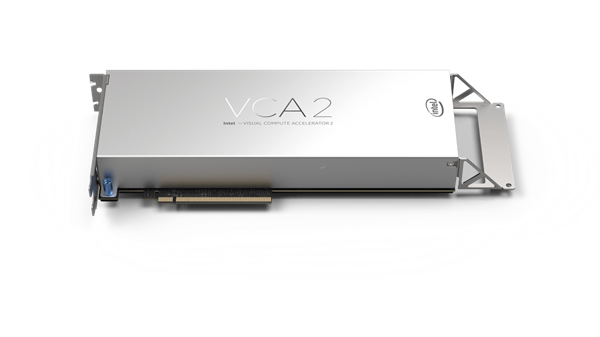

# Intel VCA2 Documentation | Intel Visual Compute Accelerator 2 Deployment Guide

**中文简介**

这是一个围绕 **Intel VCA2 / Intel Visual Compute Accelerator 2** 的整理型文档仓库，重点覆盖：

- 硬件结构与定位
- 平台兼容性与前置条件
- Host 部署思路
- Node 镜像与启动模式
- 网络、SSH 与服务部署
- 风险、限制与 FAQ

这个仓库对外只呈现整理后的使用文档，适合已经拿到完整官方驱动资料、想先把整体思路理清再动手的人。

**English Summary**

This repository provides **structured Intel VCA2 documentation** for users who want a clearer path before working with the full official driver and image package.

It focuses on:

- Intel VCA2 hardware overview
- compatibility and platform requirements
- host deployment workflow
- node images, RAMDisk vs BlockIO
- networking, SSH, and service deployment
- limitations, risks, and troubleshooting

## SEO Keywords

`Intel VCA2`, `Intel Visual Compute Accelerator 2`, `Intel VCA2 documentation`, `Intel VCA2 guide`, `Intel VCA2 deployment`, `Intel VCA2 driver`, `Intel VCA2 image`, `Intel VCA2 BlockIO`, `Intel VCA2 RAMDisk`, `Intel VCA2 Jellyfin`, `Intel VCA2 transcoding`, `Intel VCA2 compatibility`

## Start Here

### 中文入口

- [文档总览](./docs/00-文档导航.md)
- [快速开始](./docs/08-快速开始.md)
- [官方驱动与依赖文件索引](./docs/09-官方驱动与依赖文件索引.md)
- [VCA2 概览与硬件结构](./docs/01-VCA2概览与硬件结构.md)
- [兼容性、前置条件与准备清单](./docs/02-兼容性与准备清单.md)
- [宿主机部署指南](./docs/03-宿主机部署指南.md)
- [Node 镜像、启动模式与持久化](./docs/04-Node镜像与启动模式.md)
- [网络、SSH 与服务部署](./docs/05-网络访问与服务部署.md)
- [应用场景、风险、排错与 FAQ](./docs/06-应用限制风险与FAQ.md)
- [文档说明与使用边界](./docs/07-文档说明与使用边界.md)

### English Entry

- [English Documentation Guide](./docs/README.en.md)
- [English Quick Start](./docs/QUICKSTART.en.md)
- [Official Driver and Dependency Index](./docs/DRIVER-INDEX.en.md)

## What This Repository Covers

### 中文

这套文档主要帮助读者回答这些问题：

- VCA2 到底是什么，为什么它不是普通显卡
- 为什么普通家用平台大概率点不亮
- 为什么虚拟机直通通常不可行
- 为什么 BlockIO 更适合长期保留节点环境
- 节点怎么联网、怎么 SSH、怎么部署媒体服务
- 它到底适合做什么，不适合做什么

### English

This documentation is designed to answer:

- What Intel VCA2 actually is
- Why it behaves more like a multi-node server card than a normal GPU
- Why consumer platforms often fail to initialize it properly
- Why VFIO / VM passthrough is usually not the right path
- Why BlockIO is generally the better long-term boot mode
- How nodes are accessed, networked, and used for services such as media workloads

## Scope and Boundaries

### 中文

本仓库已经尽量把信息整理成可读文档，但以下内容仍应优先以配套的**完整官方驱动、镜像和相关资料**为准：

- 驱动安装命令
- 节点管理命令
- 镜像挂载命令
- 默认账号与初始密码
- 工具目录、脚本路径、服务名
- 版本对应关系

原因不是来源不可靠，而是：

- Intel 官网公开下载链路大多已经失效
- 但配套资料库中保存了完整官方驱动、镜像和相关资料
- 不同官方资料包内部的脚本、目录结构、工具版本仍可能存在差异

### English

This repository is a **structured guide**, not a replacement for the full official package.

For the following items, always defer to the official driver and image package:

- exact installation commands
- node management commands
- image mounting commands
- default credentials
- script paths, tool directories, and service names
- version-specific mappings

## Official Materials Package

### 中文

补充资料来源：

- <https://mega.nz/folder/6Y9lxYzK#NIYh72gVUlZHoSayG2ebWw>

目前公开页可确认的信息：

- `17.09 GB`
- `479 files`
- `91 subfolders`

结合现有资料背景，这个资料库保存了完整官方驱动、镜像和相关资料；本仓库则负责把使用思路整理清楚。

重点文件、目录型驱动包、代表性文件名和快捷下载链接见：

- [官方驱动与依赖文件索引](./docs/09-官方驱动与依赖文件索引.md)

### English

The linked Mega folder is understood as the **complete official driver, image, and related materials package**, while this repository serves as the structured public-facing documentation layer.

For highlighted packages, representative filenames, and quick links, see:

- [Official Driver and Dependency Index](./docs/DRIVER-INDEX.en.md)

## Suggested Reading Order

### 中文

首次接触 VCA2 时，可按以下顺序阅读：

1. `快速开始`
2. `VCA2 概览与硬件结构`
3. `兼容性、前置条件与准备清单`
4. `宿主机部署指南`
5. `Node 镜像、启动模式与持久化`
6. `网络、SSH 与服务部署`
7. `应用场景、风险、排错与 FAQ`

### English

For readers who are new to Intel VCA2, start with:

1. `English Quick Start`
2. `English Documentation Guide`
3. then use the Chinese detailed docs as the primary technical set

## Publishing Note

### 中文

- `docs/` 适合作为 GitHub 仓库主入口
- 如果后续继续公开更多资料，建议维持“整理文档”和“执行资料包”分层
- 老系统与过期驱动具有明显安全风险，不要让未隔离的宿主机直接暴露在公网

### English

- Use `docs/` as the main documentation surface for GitHub visitors
- Keep public documentation separate from package-specific execution details
- Do not expose an unisolated legacy host system directly to the public internet
